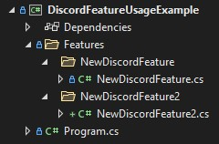

# DiscordFeature

A tiny library for easily creating features for discord bots using Discord.Net.

## Usage

```csharp
using Discord;
using Discord.WebSocket;
using static Discord.Feature;

// Login to discord
DiscordSocketConfig config = new() { AlwaysDownloadUsers = true, MessageCacheSize = 1000 };
// Reads from a file called 'token.tok' where the discord bot token is stored
await LoginAsync(TokenType.Bot, File.ReadAllText("token.tok"), config);

// Prevents the application from closing until specific word is entered
await LogoutKeyword("exit");
```

### Creating a new Feature

To create a new feature simply create a new class and have it inherit from 'Discord.Feature' or just 'Feature' if 'using Discord' is used.

```csharp
using Discord;
using Discord.WebSocket;

internal class NewDiscordFeature : Feature
{
    
}
```

Finally you need to override the 'Init' method so that you can setup the Feature.

```csharp
using Discord;
using Discord.WebSocket;

internal class NewDiscordFeature : Feature
{
    public override void Init(in DiscordSocketClient client)
    {
        client.MessageReceived += Client_MessageReceived;

        // Add more as needed
    }

    private Task Client_MessageReceived(SocketMessage arg)
    {
        Console.WriteLine(arg.Content);
        return Task.CompletedTask;
    }
}
```

And thats it, you don't need to create any instances for these features, they will be created automatically at runtime.

### Project structure

To keep things nice and neat I recommend creating a new folder called 'Features' and in that create a folder for each new feature where you would then create your feature class and other files specific to that feature in it.

It should look like so.

[https://raw.githubusercontent.com/TizzyT566/DiscordFeature/master/projectStructure.jpg](https://raw.githubusercontent.com/TizzyT566/DiscordFeature/master/projectStructure.jpg)
